<div align="center">

# OnBrand Ad Creative Kit

**One brand system in. 150 on-brand ad creatives out. One Codex run.**

Not 150 ideas — one creative concept, locked to your brand system,
multiplied across angles and canvases. The skill writes the prompt plan;
Codex's own image generation tool renders it — there is no separate
image-model account to wire up.

[What you need](#what-you-need-before-you-deploy) ·
[Deploy in 5 minutes](#deploy-in-5-minutes) ·
[The input contract](#the-input-contract) ·
[Examples](#examples) ·
[Seen in the wild](#seen-in-the-wild) ·
[Techies Lab](https://techieslab.app/)

</div>

## What you need before you deploy

| Requirement | Why | Check |
|---|---|---|
| **Codex CLI**, with its image generation tool available | reads the six inputs, writes the prompt plan, and renders the creatives — one tool, not a separate image-model integration | `codex --version` |
| **Python 3** | runs the output validator | `python3 --version` |
| **Your brand files** | logo, colour/type tokens, design rules, hooks | see [the input contract](#the-input-contract) |

No other dependencies. The validator uses the Python standard library only.



<sub>Interactive version: open [`docs/index.html`](docs/index.html) in a browser — same diagram, running.</sub>

---

## Why this exists

Generating one ad with AI is easy. Generating **fifty** that a brand lead will actually sign off on is not — because every prompt drifts a little, and fifty small drifts is a batch nobody can ship.

This kit removes the drift. You describe the brand once, in files. Every creative in every batch after that is generated from those same files, in the same order, by the same skill, and rendered by Codex's own image generation tool. The output stops depending on how you happened to phrase the prompt that day.

**The unit of work becomes the batch, not the asset.**

## What you actually get

| | Without the kit | With the kit |
|---|---|---|
| **Prompt writing** | 150 prompts, hand-written | 1 CSV row per hook; prompts are generated |
| **Brand consistency** | depends on the prompt you typed | locked to `tokens.json` + `brand.md`, every run |
| **Ratios** | one design stretched to fit | ratio-specific layouts with real safe zones |
| **Angle strategy** | whatever the model suggests | your personas and tested hooks, preserved |
| **Naming** | `final_v3_REAL.png` | `{campaign}-{hook_id}-{slug}-{ratio}.png` |
| **"Which angle won?"** | unanswerable | joinable — the hook id is in every filename |
| **QA** | eyeball 150 files | a script checks dimensions; you check the 7 things it can't |

## Deploy in 5 minutes

**1. Clone**

```bash
git clone https://github.com/Techieslab-app/onbrand-ad-creative-kit.git
cd onbrand-ad-creative-kit
```

**2. Install the skill once, use it in any project**

```bash
cp -R skill/ad-creative-recipe ~/.codex/skills/
```

**3. Fill the inputs** — copy the templates, then replace the placeholder content with yours

```bash
mkdir -p inputs/brand inputs/design-rules inputs/hooks inputs/media
cp templates/brand.md          inputs/brand/brand.md
cp templates/tokens.json       inputs/brand/tokens.json
cp templates/design-rules.md   inputs/design-rules/rules.md
cp templates/hooks.csv         inputs/hooks/hooks.csv
cp templates/personas.md       inputs/hooks/personas.md
cp templates/ad-batch.yaml     inputs/ad-batch.yaml
# drop your logo files and approved reference photos into inputs/media/
```

**4. Ask for the plan, then generate**

```text
Use the ad-creative-recipe skill in this repo to generate a prompt plan for this batch.
```

You get one prompt per hook per ratio — each carrying the exact size, the exact copy, the approved logo path, the reference image, the brand constraints, the safe-zone rules, and the output filename. Then ask Codex to render the plan — its image generation tool produces the PNGs — and save them under `outputs/<ratio>/`.

**5. Validate**

```bash
python3 scripts/validate_outputs.py outputs
```

```text
Package validation passed. Checked 150 PNG output files.
```

Then review against [`templates/qa-checklist.md`](templates/qa-checklist.md).

> **Not sure where to start?** [`examples/lovable/`](examples/lovable/) is a public-brand simulation: lightweight Lovable inputs, six generated PNG ads, embedded previews, and QA notes about what stayed stable and what drifted. Read it before you write your own.

## The input contract

Six roles. The contract is the **roles**, not the exact paths — if your team already has a brand guide, map it to the closest role and keep your original file.

| File | What it carries |
|---|---|
| `inputs/brand/brand.md` | brand narrative, audience, positioning, voice, logo rules, typography, hard avoids |
| `inputs/brand/tokens.json` | machine-readable colours, type, CTA, logo, spacing, ratio tokens |
| `inputs/design-rules/rules.md` | safe zones, composition rules, image-source rules, platform constraints |
| `inputs/hooks/hooks.csv` | one row per angle: persona, headline, support, CTA, reference image, priority, status |
| `inputs/hooks/personas.md` | who each angle is actually for |
| `inputs/media/` | logo files and the approved reference image library |

Full field-level schema: [`skill/ad-creative-recipe/references/input-contract.md`](skill/ad-creative-recipe/references/input-contract.md)

## The batch formula

```text
personas × hooks per persona × ratios = total creatives

5 personas × 10 hooks × 3 ratios = 150 creatives
```

Change one number and you know the size of the batch before you generate anything.

| Ratio | Size | Placement |
|---|---:|---|
| `1x1` | 1080 × 1080 | square feed |
| `4x5` | 1080 × 1350 | portrait feed |
| `9x16` | 1080 × 1920 | stories / reels |
| `16x9` | 1920 × 1080 | optional, horizontal |

## The three locks

This is why 150 assets still look like one brand. Take any lock away and the batch drifts.

- **Brand lock** — logo comes from the approved files, colours from `tokens.json`, type and voice from `brand.md`, hard avoids respected.
- **Layout lock** — each ratio gets its own composition with real safe zones. The same idea, adapted per canvas; never one design stretched across three.
- **Angle lock** — hooks come from your personas and campaign strategy. The model polishes copy; it does not invent the strategy, and it does not flatten localised copy into translated English.

## QA — the script's half and yours

```bash
python3 scripts/validate_outputs.py outputs
```

**The script checks:** every required package file is present; every PNG in `outputs/1x1`, `4x5`, `9x16`, `16x9` is exactly the size that ratio requires. It exits non-zero and lists each failure, so you can drop it into CI.

**Only you can check:**

- headline spelling — an image model will get it wrong eventually
- logo accuracy — a reinvented logo looks right at a glance
- palette drift — "close enough" is off-brand at scale
- whether the claim in the ad is actually true
- whether the persona/angle still makes sense for this audience
- layout variety — 50 identical compositions is a failure, not a batch
- likeness and consent for anyone in a reference photo

Checklist: [`templates/qa-checklist.md`](templates/qa-checklist.md) · rationale: [`skill/ad-creative-recipe/references/creative-qa.md`](skill/ad-creative-recipe/references/creative-qa.md)

**Automate to draft. Never automate to publish.**

## Examples

| Example | What to look at |
|---|---|
| [`examples/lovable/`](examples/lovable/) | A public-brand simulation with input brand files, embedded sample images, generated outputs, and QA notes. Good for checking whether the workflow feels stable before using your own brand. |

### Lovable output preview

Public brand signals in, generated ad bundle out.

<table>
  <tr>
    <td width="38%">
      <strong>Input logo</strong><br />
      <sub><code>examples/lovable/inputs/media/lovable-icon.svg</code></sub><br /><br />
      
      <br /><br />
      <strong>Reference image</strong><br />
      <sub><code>examples/lovable/inputs/media/lovable-opengraph.png</code></sub><br /><br />
      
    </td>
    <td width="62%">
      <strong>Input brand tokens</strong><br />
      <sub><code>examples/lovable/inputs/media/lovable-palette.svg</code></sub><br /><br />
      
      <br />
      <strong>Rules:</strong> friendly rounded sans, 0 letter spacing, clean product UI,
      chat-to-app transformation, warm light background, blue <code>Start building</code> CTA.
      Avoid robots, dark cyberpunk, fake code rain, crypto motifs, stock people, and unrelated logos.
      Generated UI is draft-only unless approved screenshots are supplied.
    </td>
  </tr>
</table>

<table>
  <tr>
    <td width="50%">
      
    </td>
    <td width="50%">
      
    </td>
  </tr>
  <tr>
    <td align="center"><sub>Founder angle, 1:1</sub></td>
    <td align="center"><sub>PM angle, 1:1</sub></td>
  </tr>
  <tr>
    <td width="50%">
      
    </td>
    <td width="50%">
      
    </td>
  </tr>
  <tr>
    <td align="center"><sub>Feed portrait, 4:5</sub></td>
    <td align="center"><sub>Story / reel, 9:16</sub></td>
  </tr>
</table>

See the full demo, inputs, prompts, and QA notes in [`examples/lovable/`](examples/lovable/).

## Repo map

```text
skill/ad-creative-recipe/     the skill itself — install this into ~/.codex/skills/
  SKILL.md                    the workflow the agent follows
  references/
    input-contract.md         field-level schema for every input file
    ratio-layouts.md          per-ratio safe zones and composition guidance
    creative-qa.md            what "on-brand" means, concretely
templates/                    copy these into inputs/ to start a campaign
  brand.md  tokens.json  design-rules.md  hooks.csv  personas.md
  ad-batch.yaml               batch settings: ratios, naming, offer
  imagegen-prompt-template.md the prompt shape the skill fills in
  qa-checklist.md             the human review pass
examples/lovable/             public-brand simulation with generated outputs
scripts/validate_outputs.py   dimension + package validator, stdlib only
inputs/                       your campaign goes here (gitignored)
outputs/1x1 4x5 9x16 16x9     generated creatives, sorted by ratio
docs/system-map.svg           the animated system map above
docs/index.html               the same thing, interactive
```

## Seen in the wild

This kit is the tooling layer of a pattern Techies Lab keeps finding in teardowns of products that grow through paid and creator distribution: **fix the concept, vary the angle, batch the production, read the results by angle.**

| Playbook | The part that shows up here |
|---|---|
| [The $20 Deposit Test — MyOtto](https://techieslab.app/playbook-myotto) | 107 Meta ads, six messaging angles, 22 dynamic creative variants in one batch. Angle-per-batch testing at production scale. |
| [Shelf](https://techieslab.app/playbook-shelf) | Eight ambassador accounts on one audience, each running a different angle on the same product truth — the angle lock, applied to seeding. |
| [Codex for Marketing](https://techieslab.app/playbook-codex-marketing) | Where an agent like Codex actually fits in a marketing workflow, and where it does not. |
| [once.film](https://techieslab.app/playbook-once-film) | Instagram-first placement — why the ratio set is a strategy decision, not an export setting. |
| [`examples/lovable/`](examples/lovable/) | A public-brand simulation showing the kit's draft quality, plus the exact place generated UI content still drifts without approved screenshots. |

All teardowns: [techieslab.app/market-playbooks](https://techieslab.app/market-playbooks)

## About Techies Lab

[Techies Lab](https://techieslab.app/) started as a community — a cross-discipline tech community across Vietnam and SEA (finance, logistics, design, marketing, code), built on the idea that your background is an advantage, not a gap to close. The consultancy and tooling side, this repo included, grew out of that community rather than the other way around.

**Join the community:** [Discord](https://discord.gg/q5qkMCAaet)

Services, case studies, and market playbooks: [techieslab.app](https://techieslab.app/)

Questions or a campaign you want run: `yolo@techieslab.app`
