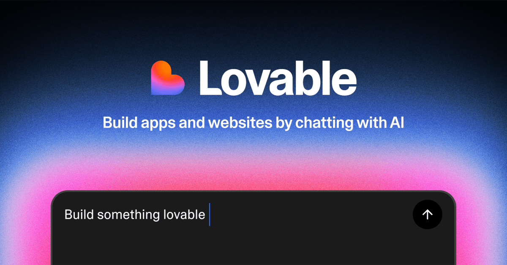
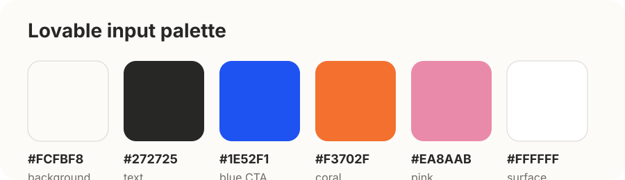
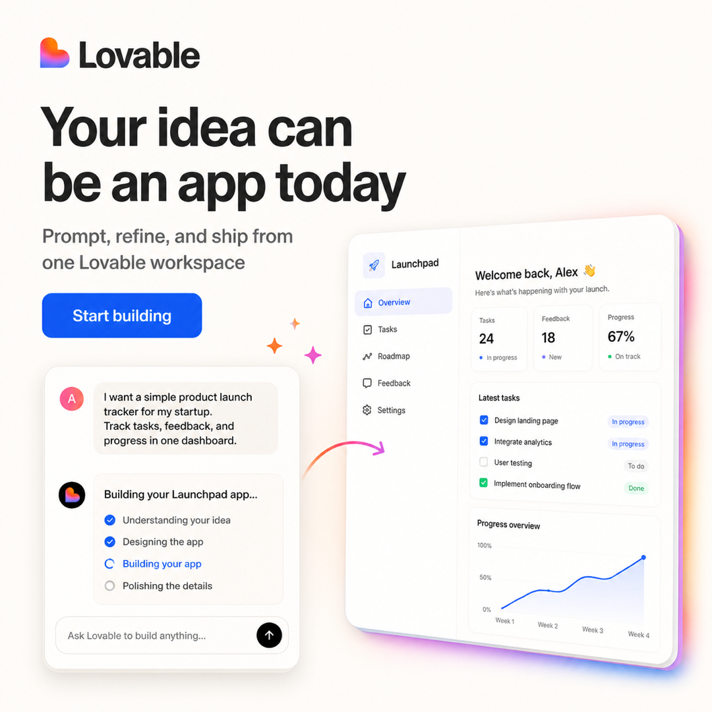
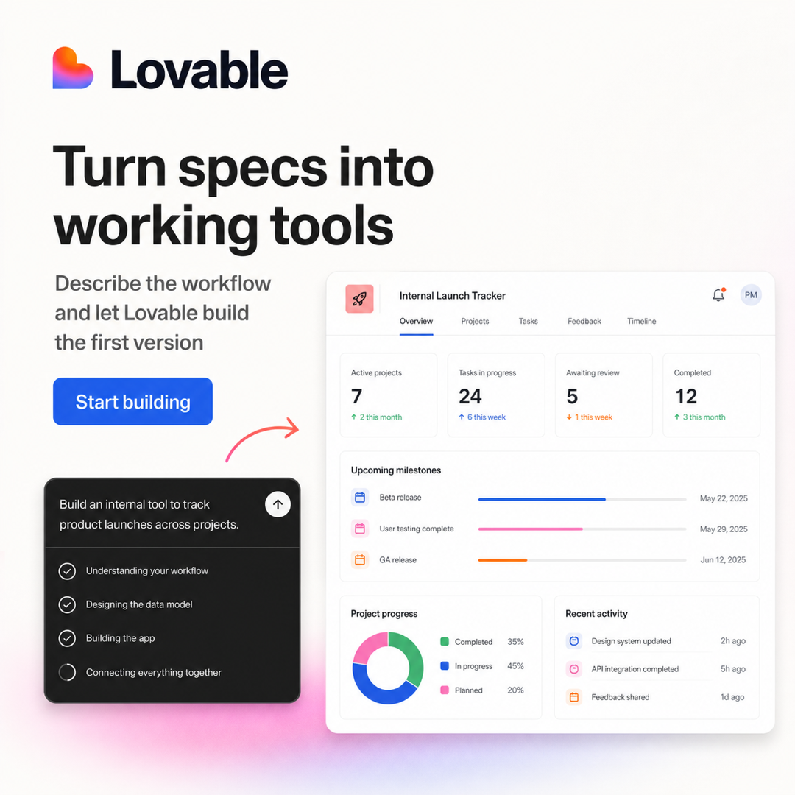
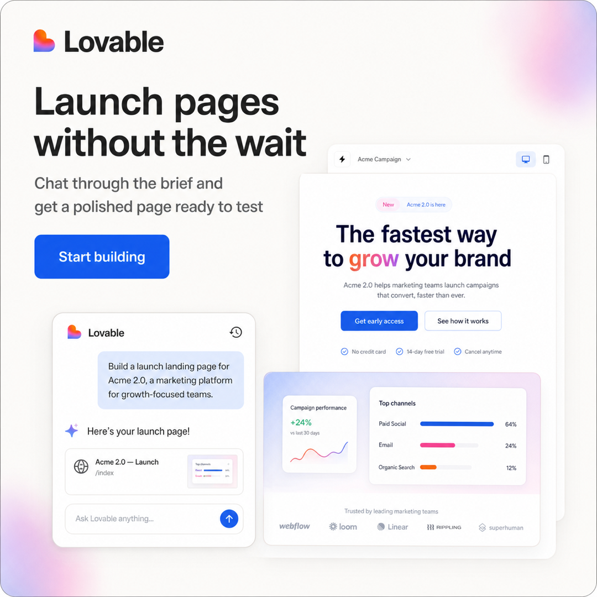
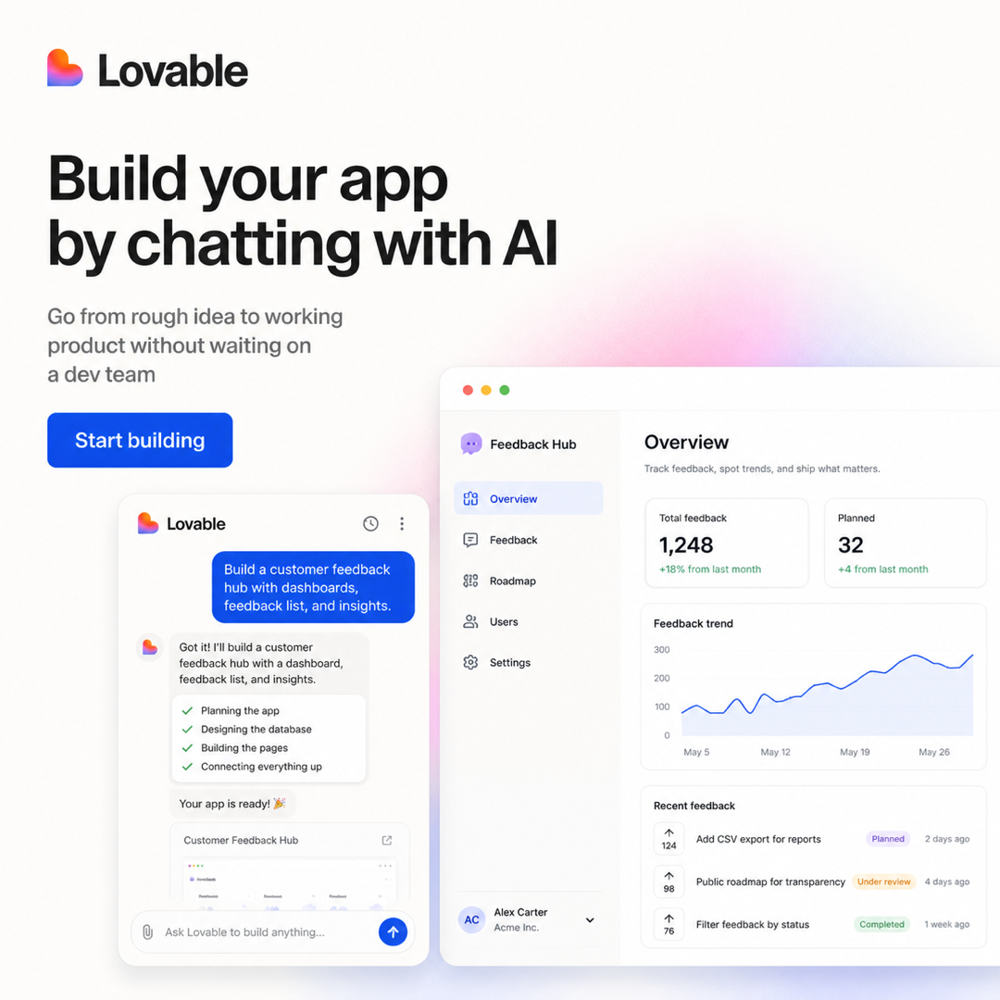
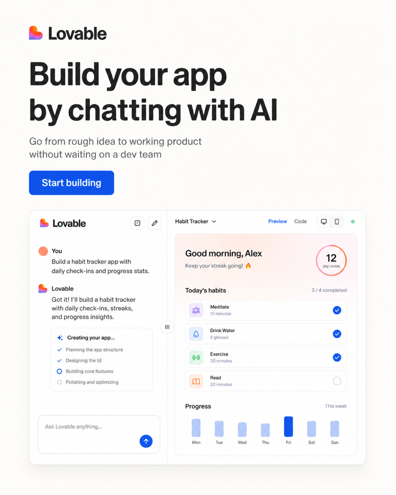
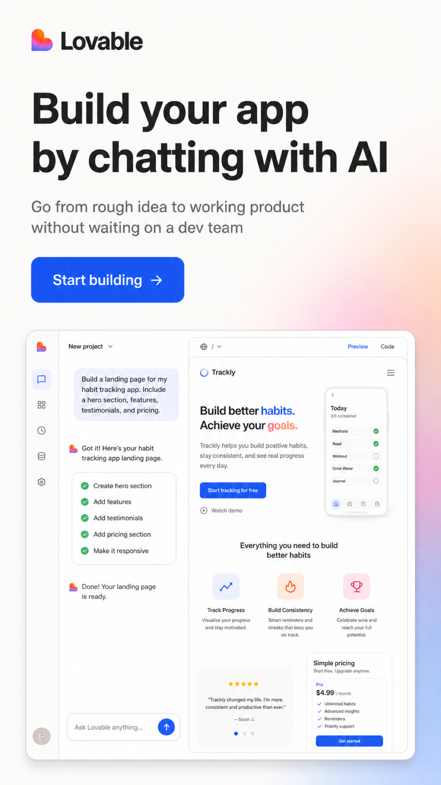

# Lovable Public Brand Demo

This example shows the kit working end-to-end with a public brand bootstrap:

```text
Lovable public brand references
-> structured inputs
-> ad creative prompts
-> generated raster outputs
-> QA notes
```

The inputs are intentionally lightweight. They are based on public Lovable brand
signals and are suitable for testing the workflow, not for production use on
behalf of Lovable without approval.

## Included Inputs

- `inputs/brand/brand.md` — brand positioning, voice, visual world, logo rules,
  color palette, type direction, and CTA direction.
- `inputs/brand/tokens.json` — machine-readable Lovable-inspired colors,
  typography, logo, and CTA values.
- `inputs/design-rules/rules.md` — ratio rules, safe zones, image rules, and
  anti-patterns.
- `inputs/hooks/hooks.csv` — the approved test hook.
- `inputs/hooks/personas.md` — founder, product manager, and marketer persona
  notes.
- `inputs/media/lovable-icon.svg` — Lovable icon input.
- `inputs/media/lovable-palette.svg` — visual palette token board.
- `inputs/media/lovable-opengraph.png` — public visual reference from the
  Lovable website.

## Input Snapshot

<table>
  <tr>
    <td width="38%">
      <strong>Logo</strong><br />
      <sub><code>inputs/media/lovable-icon.svg</code></sub><br /><br />
      
      <br /><br />
      <strong>Reference image</strong><br />
      <sub><code>inputs/media/lovable-opengraph.png</code></sub><br /><br />
      
    </td>
    <td width="62%">
      <strong>Palette</strong><br />
      <sub><code>inputs/media/lovable-palette.svg</code></sub><br /><br />
      
      <br />
      <strong>Rules:</strong> friendly rounded sans, 0 letter spacing, clean product UI,
      chat-to-app transformation, warm light background, blue <code>Start building</code> CTA.
      Avoid robots, dark cyberpunk, fake code rain, crypto motifs, stock people, and unrelated logos.
      Generated UI is draft-only unless approved screenshots are supplied.
    </td>
  </tr>
</table>

## Included Outputs

- `outputs/1x1/` — four square ad samples across founder, PM, and marketer
  angles.
- `outputs/4x5/` — one portrait feed adaptation.
- `outputs/9x16/` — one story/reel adaptation.
- `outputs/creative-plan.md` — prompt trace, QA notes, and stability verdict.

## Output Preview

### 1x1









### 4x5



### 9x16



## Run Validation

From the repo root:

```bash
python3 scripts/validate_outputs.py examples/lovable/outputs
```

Expected result:

```text
Package validation passed. Checked 6 PNG output files.
```

## Demo Verdict

The Lovable demo is stable enough for first-draft creative exploration:

- logo, color palette, CTA treatment, and clean SaaS visual language stay
  consistent across samples,
- copy remains readable and close to the approved hook,
- ratio adaptation works after resizing generated assets to the package target
  dimensions.

It is not production-safe without stronger product media constraints:

- generated UI content is invented unless approved screenshots are supplied,
- app names, dashboard text, dates, logos, and metrics can drift,
- image generation may return non-target dimensions, so post-processing is
  needed before validation.

For production use, provide approved screenshots or set a stricter product UI
mode such as `approved_screenshot_only`.
